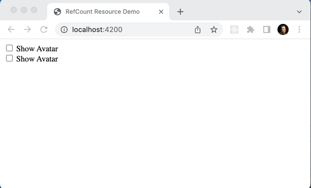

# discourse-refcount-resource-spike

This project demonstrates the usage of a refcounted tracking system to
manage the lifetime of a resource based upon registered interest.

For a more complete ember addon that uses similar primitives to manage
resources, see
[ember-resources](https://github.com/NullVoxPopuli/ember-resources).

## Overview

This simple demo optionally shows the current user's avatar in a couple places
on the home page. Visibility of each is controlled with a simple checkbox. When
an avatar is visible, we want to ensure that its associated `username` stays up
to date, so we subscribe to a mock `UserStream` "resource" to check for updates
(it actually just sets a timer and updates the current user's `username` to
`@johndoe 0`, `@johndoe 1`, etc. every second). Avatars will all share this
single resource to stay in sync. And when the resource is no longer needed, it
is automatically disconnected to reduce load on both the client and server.

In order to manage the lifetime of this resource, a refcounting system is used
that binds each avatar's lifetime to its usage of the resource.

When an avatar is shown, the associated component will register its interest
with the resource for the lifetime of the component. Internally, this will
increment a refcount by one and start the polling process within `UserStream`.

As each additional avatar is shown, its associated component will also register
its interest with the resource. Each registration will bump the shared refcount.

As each avatar is hidden, its associated component will be destroyed. Because
these components have their lifetimes linked with resource, their destruction
will automatically decrement the shared refcount.

Once this refcount reaches `0`, the shared `UserStream` resource instance will
be destroyed, which in turn will stop the polling.

## Prerequisites

You will need the following things properly installed on your computer.

* [Git](https://git-scm.com/)
* [Node.js](https://nodejs.org/)
* [PNPM](https://pnpm.io/)
* [Ember CLI](https://cli.emberjs.com/release/)
* [Google Chrome](https://google.com/chrome/)

## Installation

* `git clone <repository-url>` this repository
* `cd discourse-refcount-resource-spike`
* `pnpm install`

## Running / Development

* `ember serve`
* Visit your app at [http://localhost:4200](http://localhost:4200).
* Visit your tests at [http://localhost:4200/tests](http://localhost:4200/tests).

### Code Generators

Make use of the many generators for code, try `ember help generate` for more details

### Running Tests

* `ember test`
* `ember test --server`

### Linting

* `pnpm lint`
* `pnpm lint:fix`

### Building

* `ember build` (development)
* `ember build --environment production` (production)

### Deploying

Specify what it takes to deploy your app.

## Further Reading / Useful Links

* [ember.js](https://emberjs.com/)
* [ember-cli](https://cli.emberjs.com/release/)
* Development Browser Extensions
  * [ember inspector for chrome](https://chrome.google.com/webstore/detail/ember-inspector/bmdblncegkenkacieihfhpjfppoconhi)
  * [ember inspector for firefox](https://addons.mozilla.org/en-US/firefox/addon/ember-inspector/)
